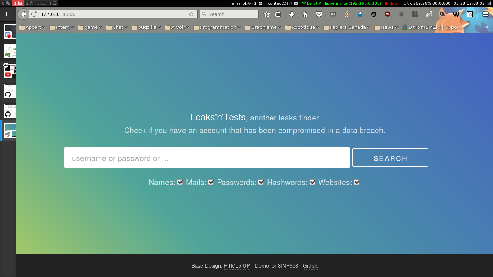
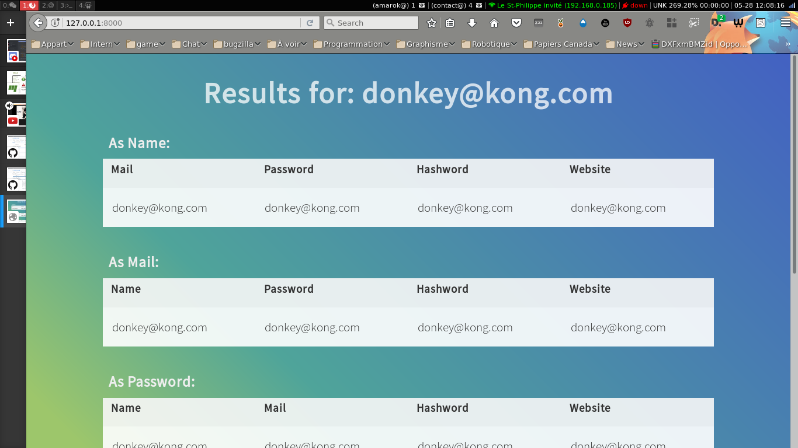

# Leak'n'test

[](https://travis-ci.org/AmarOk1412/8INF958_pres)
[](https://coveralls.io/github/AmarOk1412/8INF958_pres?branch=master)

## Description

Ce dépôt a été réalisé par [Sébastien Blin](https://github.com/AmarOk1412/) et [Baptiste Buron](https://github.com/Aburam/) pour le cours 8INF958 donné à l'UQAC donné par [Sylvain Hallé](https://github.com/sylvainhalle). Le sujet de la présentation est *Tester votre site Django*. Ce dépôt contient donc une application Django (`/leakntest`) et ses tests (back, front, de couverture).

## Démarrage d'une instance

Une fois ce dépôt cloné, il est conseiller de travailler dans un environnement virtuel :
```bash
virtualenv env
# ou "virtualenv -p python3 env"
source env/bin/activate
```

Puis pour démarrer l'application :
```bash
make install # install les dépendances
make fixtures migrate # Initialise l'application
make run # Démarre le serveur
```

Puis de vous rendre sur http://127.0.0.1:8000

Vous devriez voir :




## Processus de développement

### Contribuer

Le processus de développement est semblable au gitflow. L'idée est :
- Toute nouvelle fonctionnalité doit-être créée sur une branche à part partant de master.
- Une fois la fonctionnalité développée, une PR doit-être ouverte.
- La fonctionnalité ne doit pas casser les tests existants
- Elle doit-être accompagnée de nouveau tests
- Toute PR doit-être vérifiée par une personne externe.

### Tests Back

Les tests sont des tests unitaires Django. La documentation se trouve [ici](https://docs.djangoproject.com/en/1.11/topics/testing/overview/). Comme l'application ici est petite, ils sont tous dans le même [fichier](leakntest/tests.py). Comme pour JUnit, les tests unitaires Django ont une structure pré-test/test/post-test:

```python
class BasicTest(TestCase):
    fixtures = ['model.yaml']  # données à charger

    # pre-test
    def setUp(self):
        pass

    def test_1(self):
        pass

    # post-test
    def tearDown(self):
```

Les tests se lancent avec la commande `make test`

### Tests Front

Le tests front sont des tests Selenium avec Django. Il faut juste avoir installé préalablement le geckodriver pour firefox (ou autre pour un autre navigateur, voir la documentation de Selenium). Le geckodriver est installé ici avec la commande `make install`, voir le Makefile pour plus de détails.

Ici, il ne s'agit pas de tests unitaires, mais de tests d'intégration. Ainsi, il est souhaitable de tester toute l'application dans le même test.

Les tests se trouvent dans le même fichier que les tests back et ont cette structure :

```python
class MySeleniumTests(StaticLiveServerTestCase):
    fixtures = ['model.yaml']

    @classmethod
    def setUpClass(cls):
        super(MySeleniumTests, cls).setUpClass()
        cls.selenium = WebDriver()
        cls.selenium.implicitly_wait(10)

    @classmethod
    def tearDownClass(cls):
        cls.selenium.quit()
        super(MySeleniumTests, cls).tearDownClass()

    def test1(self):
        pass
```

### CI

Ici, les commits sont testés avec Travis CI : https://travis-ci.org/AmarOk1412/8INF958_pres

il est possible de séparer les build front et back avec `matrix`, mais ici les tests durent environ 1 minute, alors la build teste à la fois le front, le back puis envoie le résultat de coverage à https://coveralls.io

Le fichier de configuration est [.travis.yml](.travis.yml)

### Coverage

Les tests de couverture sont réalisés par la commande `coverage run --source=leakntest manage.py test` et `coveralls` se charge de présenter les informations. Il est possible de voir les détails [ici](https://coveralls.io/github/AmarOk1412/8INF958_pres?branch=master).

## Licence

```
DO WHAT THE FUCK YOU WANT TO PUBLIC LICENSE
        Version 2, December 2004

Copyright (C) 2017 Baptiste (Aburam) Buron <https://github.com/Aburam>
Copyright (C) 2017 Sébastien (AmarOk) Blin <https://enconn.fr>

Everyone is permitted to copy and distribute verbatim or modified
copies of this license document, and changing it is allowed as long
as the name is changed.

DO WHAT THE FUCK YOU WANT TO PUBLIC LICENSE
TERMS AND CONDITIONS FOR COPYING, DISTRIBUTION AND MODIFICATION

0\. You just DO WHAT THE FUCK YOU WANT TO.
```
